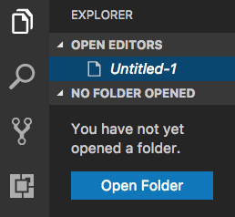
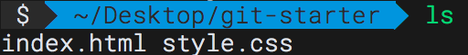
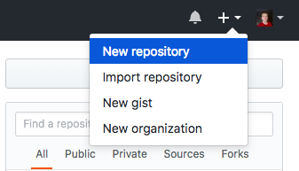
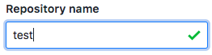
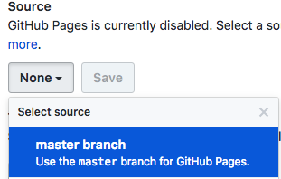
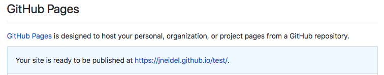
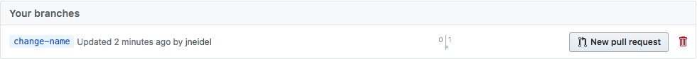

# git-intro

By Jonathan Neidel @jneidel

Online at: jneidel.com/git

---

# What we will cover

- What is git?
- Creating a git(hub) repo
- Editing files with git
- Publish a website via github pages
- Collaborative workflow
- Useful commands, files

---

# Prerequisites

- git (check using `git --version`)
- VS Code
- GitHub account

---

# What is git?

A version control system for tracking changes in files and coordinating work on those files with multiple people.

Concretely this means:

- History of all changes
- Multiple versions of the same file
- Central storage for your files (github)
- Collaborative workflow

---

# Get starter files

Get files:

- Download starter files: github.com/jneidel/git-intro/raw/master/git-starter.zip
- Unzip
- Move unpacked folder to desktop

Open in VS Code:



---

# Open starter files in terminal

Open terminal:

- Mac/Linux: Search applications for 'terminal'
- Windows:   Search applications for 'cmd'

Open in terminal (Unix):
```zsh
$ cd ~/Desktop/git-starter

$ ls
```

Open in cmd (Windows):
```zsh
$ cd Desktop/git-starter

$ dir
```

You should see something like this:


---

# Create github repo






- Copy the repo link:


---

# git init

After creating the repo on github also create a local git repo in the git-starter directory:

```zsh
$ git init
```

---

# git remote

Add github repo to local one:

```zsh
$ git remote add origin <github-repo-link>
```

`origin` is the conventional name for your upstream repo.

---

# git status

See if files have been changed, whenever they are staged:

```zsh
$ git status
```

---

# git add

Stage files for commit

```zsh
$ git add *
```

Takes any glob:

```zsh
$ git add index.html
$ git add *.html
$ git add test/**/*.test.js
```

Or multiple files/directories:

```zsh
$ git add index.html style.css
```

---

# git commit

Apply changes:

```zsh
$ git commit -m "Initial commit"
```

---

# Commit message

- Commits messages should sound like this: If applied this commit will <commit-message>.
    For example: If applied this commit will "Change [the] background color".

- Commits should be atomic, only include one distinct change:

    Good:
    - "Change background color"
    - "Update options section in readme"
    - "Add webpack config"

    Bad:
    - "Add changes" - Too unspecific
    - "Change color, add header, refactor tests" - Too much content, split up in different commits

- Commits should be capitalized followed only lowercase

- See [this article](https://chris.beams.io/posts/git-commit) for more info.

---

# git push

Synchronize your local repo with the one on github:

```zsh
$ git push origin master
```

Or in words: `push` current changes to the branch `master` of the remote repository `origin`.

---

# git pull

Synchronize local repo with changes from github:

```zsh
$ git pull origin master
```

Or in words: `pull` current changes on the `master` branch of the remote repository `origin`.

---

# GitHub Pages

Publish your static site:


- Scroll down to 'GitHub Pages'





This is where your project will be published.

---

# Feature branches

If working with multiple people you don't want everybody to commit to master.
This would lead to a lot of different versions of the same files, which would be hard to merge back together.
To avoid this one will create a feature branch before starting to work.

```zsh
$ git checkout -b change-name
```

Make changes to files and push to the github branch `change-name`

---

# Github pull request

To merge your changes on the feature branch back into `master` open a pull request on github.





- Describe changes
- 'Create pull request'

Before merging a pull request, let somebody from your team do a code review.
In your code review you step through the changes together to catch any flaws.

After merging the website will be updated.
To get the changes on your local master branch, use `git pull`.

---

# git branch

To see current branch:

```zsh
$ git branch
```

To delete the feature branch, first go back to the master branch:

```zsh
$ git checkout master
$ git branch -d change-name
```

---

# Merge conflicts

Merge conflicts occur when two people (on different branches) edit the same files and both try to merge them back into master.

---

# Produce a merge conflict

- Create a new branch `change-color` and change the background color in `style.css`.
- Change the same color on the master branch, and push that change to github.
- Pull the current master branch from github into the `change-color` branch.

This will result in a merge conflict, which can be best resolved in VS Code.

Current change specifies the state of your current branch.

Incoming change specifies the state on the branch you want to merge into your branch.

---

# .gitignore

In the `.gitignore` file you list files/directories to be ignored by git (don't show up in status, etc.).

In `.gitignore`:

```
todo.md
node_modules
package-lock.json
```

---

# readme.md

Describe the project for people visiting the repo, as this file will be automatically open on github.

In `readme.md`:

```md
# <repo-name> // Headline, h1 in html

Describe your project here
```

---

# git diff

View unstaged changes of file(s):

```zsh
$ git diff index.html
```

---

# git log

Prints the history of commits:

```zsh
$ git log --oneline --graph
```

---

# git reset

Unstages added files:

```zsh
$ git reset
```

---

# git reset --hard

Reset repo to a given commit id.

Get the id of the commit you want to reset to via `git log`.

```zsh
$ git reset --hard a3a14c8
```

The history of the remote origin differs from your local now, to overwrite the remote one use the `--force` flag:

```zsh
$ git push -f origin master
```

---

# git reflog

Prints log of changes

```zsh
$ git reflog
```

To reset the change just made via `git reset --hard`, or to roll back before a specific action use `HEAD@{n}` from `reflog`.

```zsh
$ git reset --hard HEAD@{2}
```

Only play around with these reset commands on a branch that ONLY you are using.

---

# git commit --amend

Edit the last commit with the currently staged changes.

```zsh
$ git commit --amend
```

Will open the commit message in vim, for editing (escape vim with `Esc :q!`), to skip the edit pass the `--no-edit` flag.

```zsh
$ git commit --amend --no-edit
```

